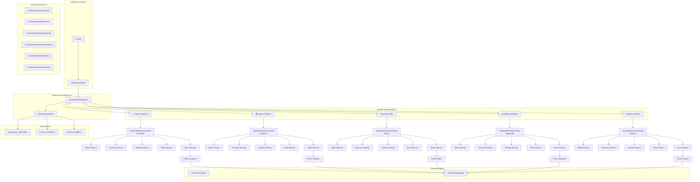
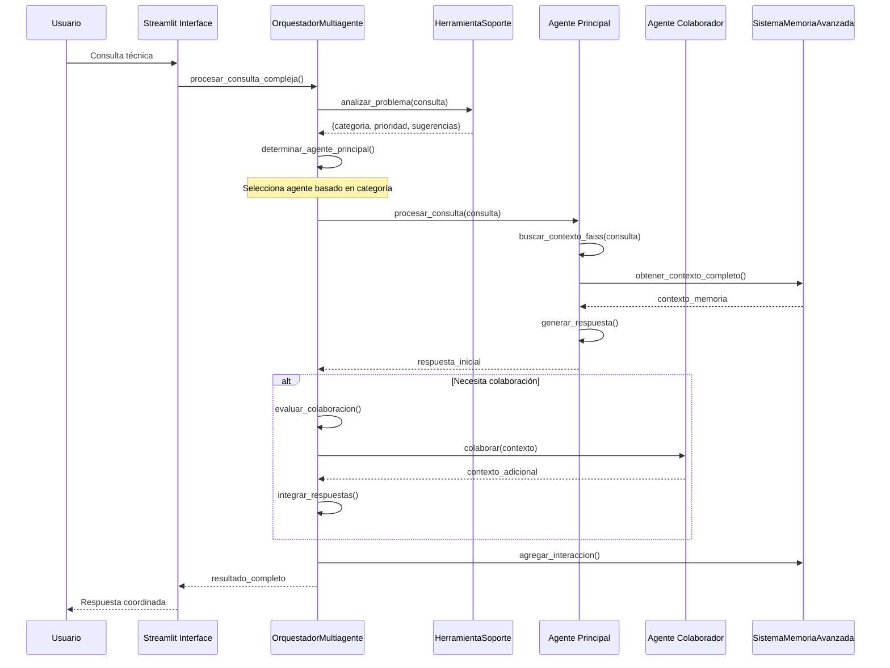
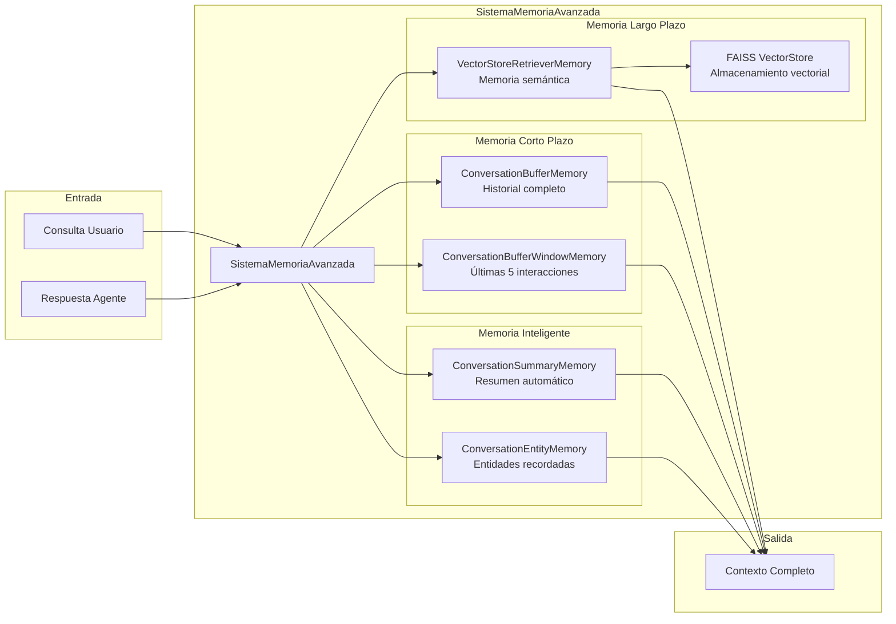
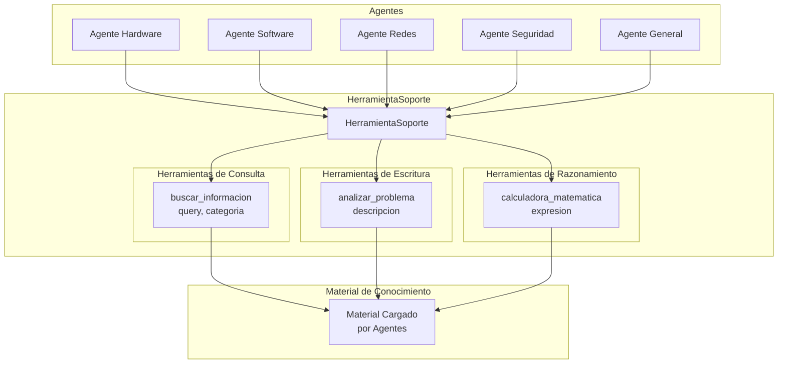
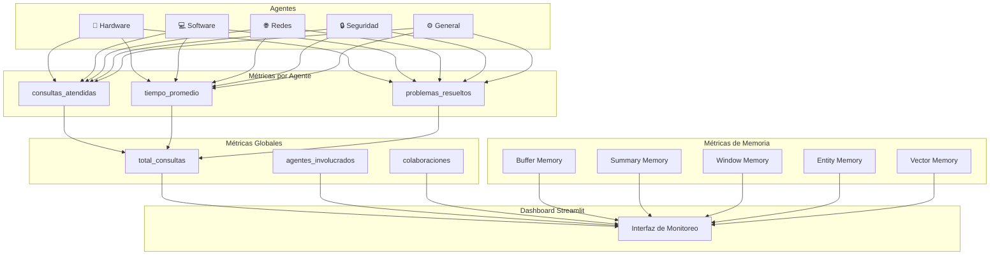
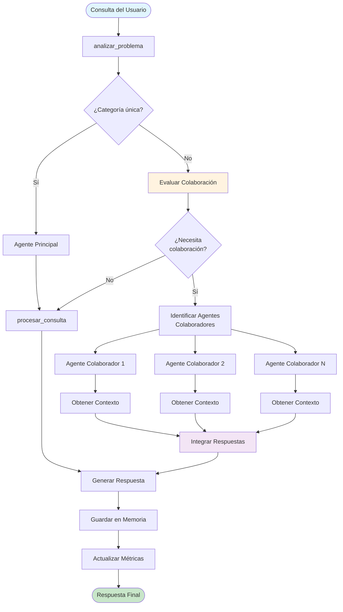
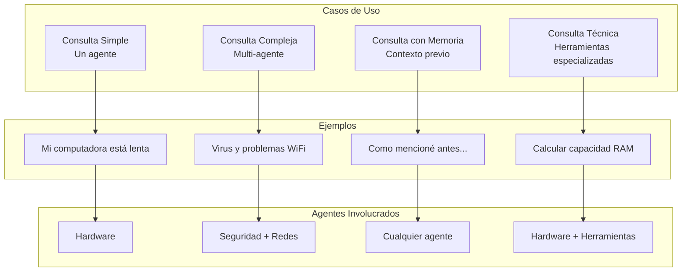

# Diagramas de Arquitectura - Sistema Multi-Agente

```mermaid
graph TB
    subgraph "Interfaz de Usuario"
        U[Usuario]
        SI[Streamlit Interface]
    end
    
    subgraph "Sistema de Orquestación"
        OM[OrquestadorMultiagente]
        HS[HerramientaSoporte]
    end
    
    subgraph "Agentes Especializados"
        AH[🔧 Agente Hardware]
        AS[💻 Agente Software]
        AR[🌐 Agente Redes]
        ASE[🔒 Agente Seguridad]
        AG[⚙️ Agente General]
    end
    
    subgraph "Sistema de Memoria"
        MA[SistemaMemoriaAvanzada]
        BM[ConversationBufferMemory]
        SM[ConversationSummaryMemory]
        WM[ConversationBufferWindowMemory]
        EM[ConversationEntityMemory]
        VM[VectorStoreRetrieverMemory]
    end
    
    subgraph "Almacenamiento"
        FAISS[FAISS VectorStore]
        EMB[OpenAI Embeddings]
    end
    
    subgraph "Herramientas"
        CM[calculadora_matematica]
        BI[buscar_informacion]
        AP[analizar_problema]
    end
    
    U --> SI
    SI --> OM
    OM --> HS
    OM --> AH
    OM --> AS
    OM --> AR
    OM --> ASE
    OM --> AG
    
    HS --> CM
    HS --> BI
    HS --> AP
    
    AH --> MA1[SistemaMemoriaAvanzada<br/>Hardware]
    AS --> MA2[SistemaMemoriaAvanzada<br/>Software]
    AR --> MA3[SistemaMemoriaAvanzada<br/>Redes]
    ASE --> MA4[SistemaMemoriaAvanzada<br/>Seguridad]
    AG --> MA5[SistemaMemoriaAvanzada<br/>General]
    
    MA1 --> BM1[Buffer Memory]
    MA1 --> SM1[Summary Memory]
    MA1 --> WM1[Window Memory]
    MA1 --> EM1[Entity Memory]
    MA1 --> VM1[Vector Memory]
    
    MA2 --> BM2[Buffer Memory]
    MA2 --> SM2[Summary Memory]
    MA2 --> WM2[Window Memory]
    MA2 --> EM2[Entity Memory]
    MA2 --> VM2[Vector Memory]
    
    MA3 --> BM3[Buffer Memory]
    MA3 --> SM3[Summary Memory]
    MA3 --> WM3[Window Memory]
    MA3 --> EM3[Entity Memory]
    MA3 --> VM3[Vector Memory]
    
    MA4 --> BM4[Buffer Memory]
    MA4 --> SM4[Summary Memory]
    MA4 --> WM4[Window Memory]
    MA4 --> EM4[Entity Memory]
    MA4 --> VM4[Vector Memory]
    
    MA5 --> BM5[Buffer Memory]
    MA5 --> SM5[Summary Memory]
    MA5 --> WM5[Window Memory]
    MA5 --> EM5[Entity Memory]
    MA5 --> VM5[Vector Memory]
    
    VM1 --> FAISS1[FAISS Hardware]
    VM2 --> FAISS2[FAISS Software]
    VM3 --> FAISS3[FAISS Redes]
    VM4 --> FAISS4[FAISS Seguridad]
    VM5 --> FAISS5[FAISS General]
    
    FAISS1 --> EMB
    FAISS2 --> EMB
    FAISS3 --> EMB
    FAISS4 --> EMB
    FAISS5 --> EMB
```

```mermaid
sequenceDiagram
    participant U as Usuario
    participant SI as Streamlit Interface
    participant O as OrquestadorMultiagente
    participant H as HerramientaSoporte
    participant A1 as Agente Principal
    participant A2 as Agente Colaborador
    participant M as SistemaMemoriaAvanzada
    
    U->>SI: Consulta técnica
    SI->>O: procesar_consulta_compleja()
    
    O->>H: analizar_problema(consulta)
    H-->>O: {categoria, prioridad, sugerencias}
    
    O->>O: determinar_agente_principal()
    Note over O: Selecciona agente basado en categoría
    
    O->>A1: procesar_consulta(consulta)
    A1->>A1: buscar_contexto_faiss(consulta)
    A1->>M: obtener_contexto_completo()
    M-->>A1: contexto_memoria
    A1->>A1: generar_respuesta()
    A1-->>O: respuesta_inicial
    
    alt Necesita colaboración
        O->>O: evaluar_colaboracion()
        O->>A2: colaborar(contexto)
        A2-->>O: contexto_adicional
        O->>O: integrar_respuestas()
    end
    
    O->>M: agregar_interaccion()
    O-->>SI: resultado_completo
    SI-->>U: Respuesta coordinada
```

```mermaid
graph LR
    subgraph "Entrada"
        C[Consulta Usuario]
        R[Respuesta Agente]
    end
    
    subgraph "SistemaMemoriaAvanzada"
        MA[SistemaMemoriaAvanzada]
        
        subgraph "Memoria Corto Plazo"
            BM[ConversationBufferMemory<br/>Historial completo]
            WM[ConversationBufferWindowMemory<br/>Últimas 5 interacciones]
        end
        
        subgraph "Memoria Inteligente"
            SM[ConversationSummaryMemory<br/>Resumen automático]
            EM[ConversationEntityMemory<br/>Entidades recordadas]
        end
        
        subgraph "Memoria Largo Plazo"
            VM[VectorStoreRetrieverMemory<br/>Memoria semántica]
            FAISS[FAISS VectorStore<br/>Almacenamiento vectorial]
        end
    end
    
    subgraph "Salida"
        CTX[Contexto Completo]
    end
    
    C --> MA
    R --> MA
    
    MA --> BM
    MA --> WM
    MA --> SM
    MA --> EM
    MA --> VM
    
    VM --> FAISS
    
    BM --> CTX
    WM --> CTX
    SM --> CTX
    EM --> CTX
    VM --> CTX
```

```mermaid
graph TD
    subgraph "HerramientaSoporte"
        HS[HerramientaSoporte]
        
        subgraph "Herramientas de Consulta"
            BI[buscar_informacion<br/>query, categoria]
        end
        
        subgraph "Herramientas de Escritura"
            AP[analizar_problema<br/>descripcion]
        end
        
        subgraph "Herramientas de Razonamiento"
            CM[calculadora_matematica<br/>expresion]
        end
    end
    
    subgraph "Material de Conocimiento"
        MC[Material Cargado<br/>por Agentes]
    end
    
    subgraph "Agentes"
        AH[Agente Hardware]
        AS[Agente Software]
        AR[Agente Redes]
        ASE[Agente Seguridad]
        AG[Agente General]
    end
    
    HS --> BI
    HS --> AP
    HS --> CM
    
    BI --> MC
    AP --> MC
    CM --> MC
    
    AH --> HS
    AS --> HS
    AR --> HS
    ASE --> HS
    AG --> HS
```

```mermaid
graph TB
    subgraph "Agentes"
        AH[🔧 Hardware]
        AS[💻 Software]
        AR[🌐 Redes]
        ASE[🔒 Seguridad]
        AG[⚙️ General]
    end
    
    subgraph "Métricas por Agente"
        MA1[consultas_atendidas]
        MA2[tiempo_promedio]
        MA3[problemas_resueltos]
    end
    
    subgraph "Métricas Globales"
        MG1[total_consultas]
        MG2[agentes_involucrados]
        MG3[colaboraciones]
    end
    
    subgraph "Métricas de Memoria"
        MM1[Buffer Memory]
        MM2[Summary Memory]
        MM3[Window Memory]
        MM4[Entity Memory]
        MM5[Vector Memory]
    end
    
    subgraph "Dashboard Streamlit"
        DS[Interfaz de Monitoreo]
    end
    
    AH --> MA1
    AS --> MA1
    AR --> MA1
    ASE --> MA1
    AG --> MA1
    
    AH --> MA2
    AS --> MA2
    AR --> MA2
    ASE --> MA2
    AG --> MA2
    
    AH --> MA3
    AS --> MA3
    AR --> MA3
    ASE --> MA3
    AG --> MA3
    
    MA1 --> MG1
    MA2 --> MG1
    MA3 --> MG1
    
    MG1 --> DS
    MG2 --> DS
    MG3 --> DS
    
    MM1 --> DS
    MM2 --> DS
    MM3 --> DS
    MM4 --> DS
    MM5 --> DS
```

```mermaid
flowchart TD
    Start([Consulta del Usuario]) --> Analyze[analizar_problema]
    
    Analyze --> Category{¿Categoría única?}
    
    Category -->|Sí| SingleAgent[Agente Principal]
    Category -->|No| MultiAgent[Evaluar Colaboración]
    
    SingleAgent --> Process[procesar_consulta]
    Process --> Response[Generar Respuesta]
    
    MultiAgent --> NeedCollab{¿Necesita<br/>colaboración?}
    
    NeedCollab -->|No| Process
    NeedCollab -->|Sí| Identify[Identificar Agentes<br/>Colaboradores]
    
    Identify --> Collab1[Agente Colaborador 1]
    Identify --> Collab2[Agente Colaborador 2]
    Identify --> CollabN[Agente Colaborador N]
    
    Collab1 --> Context1[Obtener Contexto]
    Collab2 --> Context2[Obtener Contexto]
    CollabN --> ContextN[Obtener Contexto]
    
    Context1 --> Integrate[Integrar Respuestas]
    Context2 --> Integrate
    ContextN --> Integrate
    
    Integrate --> Response
    
    Response --> Memory[Guardar en Memoria]
    Memory --> Metrics[Actualizar Métricas]
    Metrics --> End([Respuesta Final])
    
    style Start fill:#e1f5fe
    style End fill:#c8e6c9
    style MultiAgent fill:#fff3e0
    style Integrate fill:#f3e5f5
```

```mermaid
graph TB
    subgraph "Casos de Uso"
        UC1[Consulta Simple<br/>Un agente]
        UC2[Consulta Compleja<br/>Multi-agente]
        UC3[Consulta con Memoria<br/>Contexto previo]
        UC4[Consulta Técnica<br/>Herramientas especializadas]
    end
    
    subgraph "Ejemplos"
        E1["Mi computadora está lenta"]
        E2["Virus y problemas WiFi"]
        E3["Como mencioné antes..."]
        E4["Calcular capacidad RAM"]
    end
    
    subgraph "Agentes Involucrados"
        A1[Hardware]
        A2[Seguridad + Redes]
        A3[Cualquier agente]
        A4[Hardware + Herramientas]
    end
    
    UC1 --> E1
    UC2 --> E2
    UC3 --> E3
    UC4 --> E4
    
    E1 --> A1
    E2 --> A2
    E3 --> A3
    E4 --> A4
```